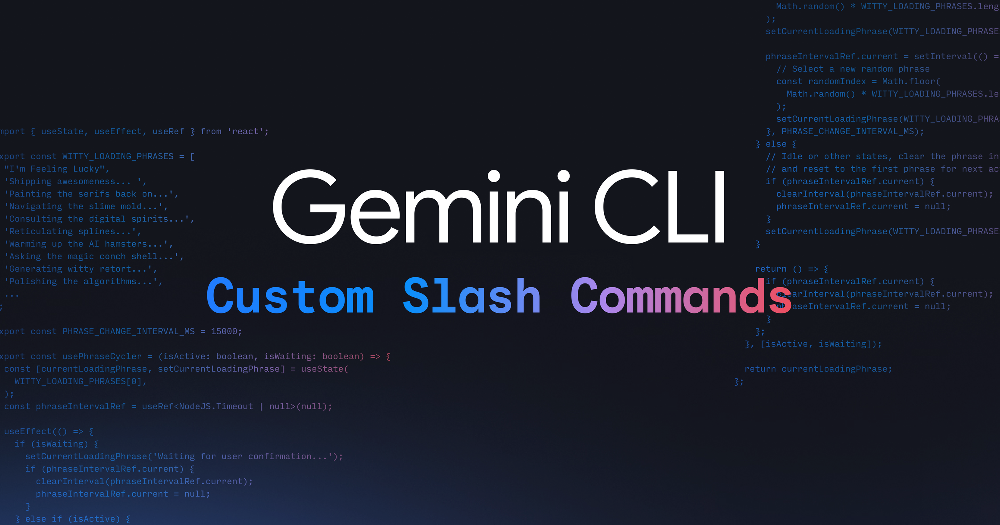

# Gemini CLI: Custom slash commands
# Gemini CLI：自定义斜杠命令

July 31, 2025
2025年7月31日



**Jack Wotherspoon**  
Developer Advocate
开发者倡导者

**Abhi Patel**  
Software Engineer
软件工程师

Today, we're announcing support for custom slash commands in [Gemini CLI](https://github.com/google-gemini/gemini-cli)! This highly requested feature lets you define reusable prompts for streamlining interactions with Gemini CLI and helps improve efficiency across workflows. Slash commands can be defined in local .toml files or through Model Context Protocol (MCP) prompts. Get ready to transform how you leverage Gemini CLI with the new power of slash commands!
今天，我们宣布 [Gemini CLI](https://github.com/google-gemini/gemini-cli) 正式支持自定义斜杠（slash）命令！这一备受期待的功能允许您定义可重复使用的提示词（prompts），以简化与 Gemini CLI 的交互，并帮助提高各项工作流的效率。斜杠命令可以在本地 .toml 文件中定义，也可以通过模型上下文协议（Model Context Protocol, MCP）提示词进行定义。准备好利用斜杠命令的新功能，彻底改变您使用 Gemini CLI 的方式吧！


To use slash commands, make sure that you update to the latest version of Gemini CLI.
要使用斜杠命令，请确保您已更新到最新版本的 Gemini CLI。

**Update npx:**
**更新 npx：**

```bash
npx @google/gemini-cli
```

**Update npm:**
**更新 npm：**

```bash
npm install -g @google/gemini-cli@latest
```

## Powerful and extensible foundation with .toml files
## 基于 .toml 文件的强大且可扩展的基础

The foundation of custom slash commands is rooted in .toml files.
自定义斜杠命令的基础植根于 .toml 文件。

The .toml file provides a powerful and structured base on which to build extensive support for complex commands. To help support a wide range of users, we made the required keys minimal (just prompt). And we support easy-to-use args with `{{args}}` and shell command execution `!{...}` directly into the prompt.
.toml 文件提供了一个强大且结构化的基础，用于为复杂命令构建广泛的支持。为了支持各种用户，我们将必填键设为最少（仅需 prompt）。此外，我们还支持直接在提示词中使用 `{{args}}` 轻松调用参数，以及使用 `!{...}` 执行 shell 命令。

Here is an example .toml file that is invoked using `/review <issue_number>` from Gemini CLI to review a GitHub PR. Notice that the file name defines the command name and it's case sensitive. For more information about custom slash commands, see the [Custom Commands](https://github.com/google-gemini/gemini-cli/blob/main/docs/cli/commands.md#custom-commands) section of the Gemini CLI documentation.
下面是一个示例 .toml 文件，在 Gemini CLI 中通过 `/review <issue_number>` 调用来审查 GitHub PR。请注意，文件名定义了命令名称，并且区分大小写。有关自定义斜杠命令的更多信息，请参阅 Gemini CLI 文档中的[自定义命令](https://github.com/google-gemini/gemini-cli/blob/main/docs/cli/commands.md#custom-commands)部分。

```toml
description="Reviews a pull request based on issue number."
prompt = """
Please provide a detailed pull request review on GitHub issue {{args}}.

Follow these steps:

1. Use `gh pr view {{args}}` to pull the information of the PR.
2. Use `gh pr diff {{args}}` to view the diff of the PR.
3. Understand the intent of the PR using the PR description.
4. If PR description is not detailed enough to understand the intent,
   make sure to note it in your review.
5. Make sure the PR title follows Conventional Commits, here are some
   commits to the repo as examples: !{git log --pretty=format:%s -n 5}
6. Search the codebase if required.
7. Write a concise review of the PR, keeping in mind to encourage code
   quality and best practices.
8. Use `gh pr comment {{args}} --body {{review}}` to post the review.

Remember to use the GitHub CLI (`gh`) with the Shell tool for all
GitHub-related tasks.
"""
```

## Namespacing
## 命名空间

The name of a command is determined by its file path relative to the commands directory. Sub-directories are used to create namespaced commands, with the path separator (/ or \) being converted to a colon (:).
命令的名称由其相对于 commands 目录的文件路径决定。子目录用于创建带命名空间的命令，路径分隔符（/ 或 \）会被转换为冒号（:）。

*   A file at `<project>/.gemini/commands/test.toml` becomes the command `/test`.
    位于 `<project>/.gemini/commands/test.toml` 的文件变为命令 `/test`。
*   A file at `<project>/.gemini/commands/git/commit.toml` becomes the namespaced command `/git:commit`.
    位于 `<project>/.gemini/commands/git/commit.toml` 的文件变为带命名空间的命令 `/git:commit`。


This allows grouping related commands under a single namespace.
这允许将相关命令分组到同一个命名空间下。

## Building a slash command
## 构建斜杠命令

The next few sections show you how to build a slash command for Gemini CLI.
接下来的几个部分将向您展示如何为 Gemini CLI 构建斜杠命令。

### 1 - Create the command file
### 1 - 创建命令文件

First, create a file named `plan.toml` inside the `~/.gemini/commands/` directory. Doing so will let you create a `/plan` command to tell Gemini CLI to only plan the changes by providing a step-by-step plan and to not start on implementation. This approach will let you provide feedback and iterate on the plan before implementation.
首先，在 `~/.gemini/commands/` 目录中创建一个名为 `plan.toml` 的文件。这样您就可以创建一个 `/plan` 命令，告诉 Gemini CLI 仅通过提供分步计划来规划更改，而不开始执行。这种方法允许您在实施之前对计划进行反馈和迭代。

Custom slash commands can be scoped to an individual user or project by defining the .toml files in designated directories.
自定义斜杠命令可以通过在指定目录中定义 .toml 文件来限定于单个用户或项目。

*   User-scoped commands are available across all Gemini CLI projects for a user and are stored in `~/.gemini/commands/` (note the ~).
    用户作用域的命令对用户的所有 Gemini CLI 项目都可用，并存储在 `~/.gemini/commands/` 中（注意波浪号 ~）。
*   Project-scoped commands are only available from sessions within a given project and are stored in `.gemini/commands/`.
    项目作用域的命令仅在特定项目内的会话中可用，并存储在 `.gemini/commands/` 中。

**Hint:** To streamline project workflows, check these into Git repositories!
**提示：** 为了简化项目工作流，请将这些文件提交到 Git 仓库中！

```bash
mkdir -p ~/.gemini/commands
touch ~/.gemini/commands/plan.toml
```

### 2 - Add the command definition
### 2 - 添加命令定义

Open `plan.toml` and add the following content:
打开 `plan.toml` 并添加以下内容：

```toml
# ~/.gemini/commands/plan.toml

description="Investigates and creates a strategic plan to achieve the goal."
prompt = """
Your primary role is that of a strategist, not an implementer.
Your task is to stop, think deeply, and devise a comprehensive plan.

You MUST NOT write, modify, or execute any code. Your sole focus is planning.

Use your available "read" and "search" tools to research and analyze.

Present your strategic plan in markdown. It should be the definitive guide.

1.  **Understanding the Goal:** Re-state the objective to confirm understanding.
2.  **Investigation & Analysis:** Describe the investigative steps taken.
3.  **Proposed Strategic Approach:** Outline the high-level steps.
4.  **Verification Strategy:** Explain how the success of the plan will be verified.
5.  **Anticipated Challenges & Considerations:** Based on your research.

Your final output should be ONLY this strategic plan.
"""
```

### 3 - Use the command
### 3 - 使用命令

Now you can use this command within Gemini CLI:
现在您可以在 Gemini CLI 中使用此命令了：

```bash
/plan How can I make the project more performant?
```

Gemini will plan out the changes and output a detailed step-by-step execution plan!
Gemini 将规划更改并输出详细的分步执行计划！

## Enriched integration with MCP Prompts
## 与 MCP 提示词的深度集成

Gemini CLI now offers a more integrated experience with MCP by supporting [MCP Prompts](https://modelcontextprotocol.io/specification/2025-06-18/server/prompts) as slash commands! MCP provides a standardized way for servers to expose prompt templates to clients. Gemini CLI utilizes this to expose available prompts for configured MCP servers and make the prompts available as slash commands.
Gemini CLI 现在通过支持 [MCP 提示词](https://modelcontextprotocol.io/specification/2025-06-18/server/prompts)作为斜杠命令，提供了与 MCP 更深度的集成体验！MCP 为服务器向客户端公开提示词模板提供了一种标准化的方式。Gemini CLI 利用这一点来公开已配置 MCP 服务器的可用提示词，并使这些提示词作为斜杠命令可用。

The name and description of the MCP prompt is used as the slash command name and description. MCP prompt arguments are also supported and leveraged in slash commands by using `/mycommand --<argument_name>="<argument_value>"` or positionally `/mycommand <argument1> <argument2>`.
MCP 提示词的名称和描述被用作斜杠命令的名称和描述。MCP 提示词参数也受支持，并可通过在斜杠命令中使用 `/mycommand --<argument_name>="<argument_value>"` 或按位置使用 `/mycommand <argument1> <argument2>` 来调用。

The following is an example `/research` command that uses [FastMCP](https://gofastmcp.com/getting-started/welcome) Python server:
以下是一个使用 [FastMCP](https://gofastmcp.com/getting-started/welcome) Python 服务器的 `/research` 命令示例：


## Easy to get started
## 轻松开始

So what are you waiting for? Upgrade your terminal experience with [Gemini CLI](https://github.com/google-gemini/gemini-cli) today and try out custom slash commands to streamline your workflows. To learn more, check out the [Custom Commands](https://github.com/google-gemini/gemini-cli/blob/main/docs/cli/commands.md#custom-commands) documentation for the Gemini CLI.
还等什么？立即使用 [Gemini CLI](https://github.com/google-gemini/gemini-cli) 升级您的终端体验，并尝试使用自定义斜杠命令来简化您的工作流。欲了解更多信息，请查看 Gemini CLI 的[自定义命令](https://github.com/google-gemini/gemini-cli/blob/main/docs/cli/commands.md#custom-commands)文档。
